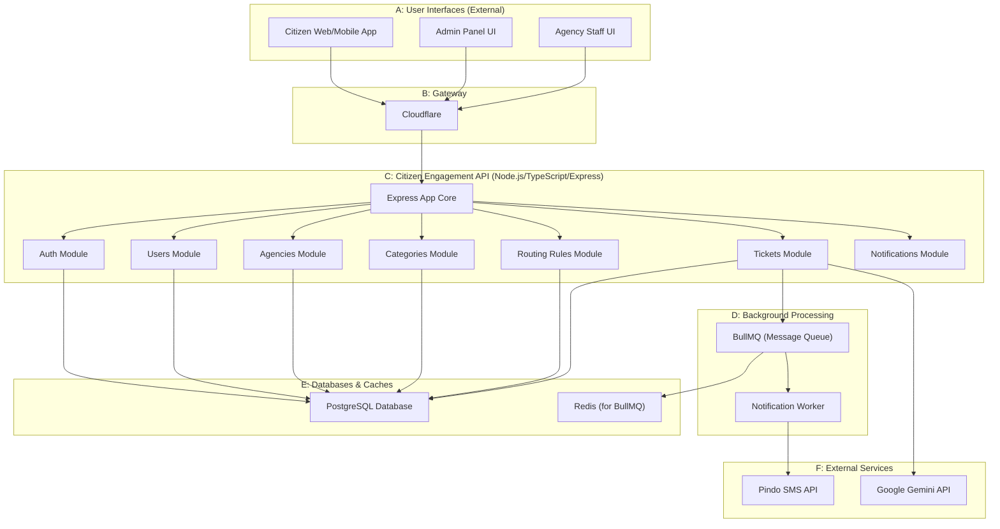
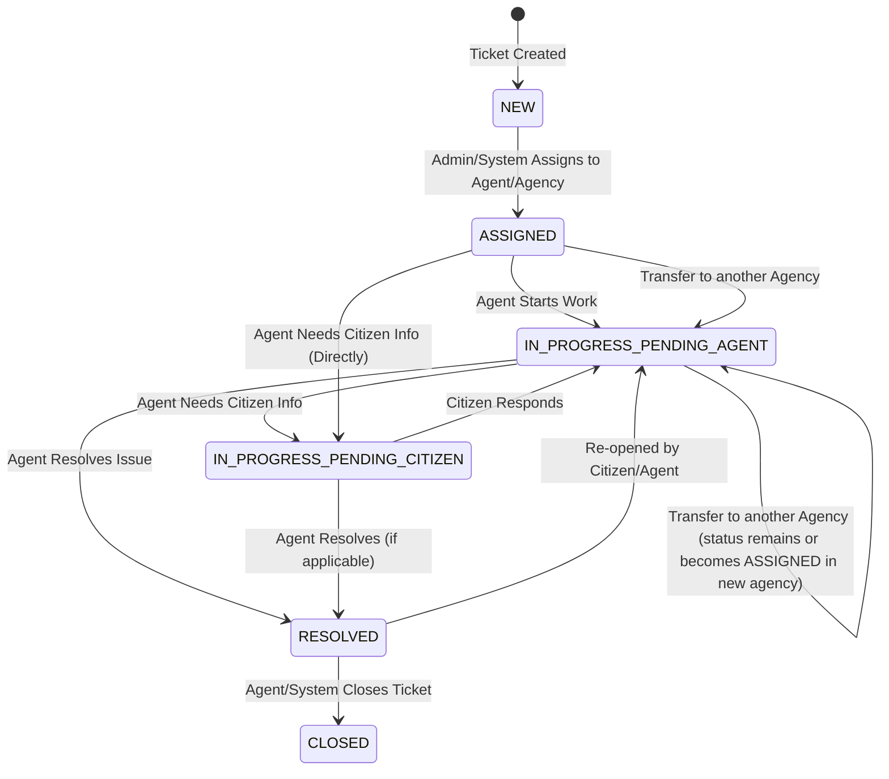

# Citizen Engagement System API

## Overview

The Citizen Engagement System is a robust solution designed to facilitate communication between citizens and government agencies. It allows citizens to submit complaints or feedback on public services, which are then categorized, routed to the appropriate agency, and tracked through their lifecycle. The system supports notifications, an admin panel for management, and an agency panel for handling tickets. A key feature is AI-assisted routing for uncategorized submissions.

This APP is built with a focus on scalability, modularity, and best practices using Node.js, TypeScript, Express.js, Prisma ORM, PostgreSQL, BullMQ for background jobs, and integrates with Google's Gemini API for AI features and Pindo for SMS notifications.

## Table of Contents

1.  [Features](#features)
2.  [System Architecture](#system-architecture)
    *   [High-Level Diagram](#high-level-diagram)
    *   [Core Components](#core-components)
    *   [Technology Stack](#technology-stack)
3.  [Modularity & Scalability](#modularity--scalability)
4.  [Key Functionalities & Workflows](#key-functionalities--workflows)
    *   [User Roles](#user-roles)
    *   [Account Creation & Authentication](#account-creation--authentication)
    *   [Complaint Submission](#complaint-submission)
    *   [Ticket Lifecycle & Routing](#ticket-lifecycle--routing)
    *   [AI-Assisted Routing](#ai-assisted-routing)
    *   [SMS Notifications](#sms-notifications)
    *   [Admin & Agency Management](#admin--agency-management)
5.  [Project Structure](#project-structure)
6.  [Setup and Installation](#setup-and-installation)
    *   [Prerequisites](#prerequisites)
    *   [Environment Variables](#environment-variables)
    *   [Installation Steps](#installation-steps)
    *   [Running the Application](#running-the-application)
7.  [API Endpoints](#api-endpoints)
8.  [Testing](#testing)
9.  [Future Enhancements](#future-enhancements)
10. [Contributing](#contributing)
11. [License](#license)

## Features

*   **Citizen Portal:** Submit, track, and communicate on complaints/feedback.
*   **Admin Panel:** Manage users (admins, agency staff), government agencies, complaint categories, and routing rules. Gain insights into system activity.
*   **Agency Panel:** Receive and manage assigned complaint tickets, update status, and communicate with citizens.
*   **Role-Based Access Control (RBAC):** Distinct permissions for Citizens, Agency Staff, and Admins.
*   **Complaint Ticketing System:**
    *   Unique ticket IDs.
    *   Categorization and prioritization.
    *   Status tracking (New, Assigned, In Progress, Resolved, Closed).
    *   Communication log (public and internal notes).
*   **Automated Ticket Routing:**
    *   Rule-based routing using a configurable routing table (Category -> Agency).
    *   **AI-Assisted Routing:** For tickets submitted without a category, Gemini API suggests the appropriate agency based on ticket details and routing table context.
*   **SMS Notifications:** Real-time updates to citizens via SMS for significant ticket events (e.g., creation, status change, agent reply) using BullMQ and Pindo.
*   **Anonymous Submissions:** Option for citizens to submit complaints anonymously.
*   **Ticket Transfer:** Agency staff can transfer tickets to other relevant agencies.
*   **Scalable Architecture:** Built with modularity and modern technologies to handle growth.

## System Architecture

### High-Level Diagram



### Core Components

1.  **Express.js Application Core:** Handles HTTP requests, routing, and middleware.
2.  **Modular Design:** Each primary entity (Users, Tickets, Agencies, etc.) is encapsulated in its own module within `src/modules/`. Each module typically contains:
    *   `*.controller.ts`: Handles request/response lifecycle, calls services.
    *   `*.service.ts`: Contains business logic, orchestrates repository calls.
    *   `*.repository.ts`: Interacts directly with the database (Prisma).
    *   `*.routes.ts`: Defines API endpoints for the module.
    *   `dto/`: Data Transfer Objects for request validation (using Zod).
    *   `interfaces/`: TypeScript interfaces for the module.
3.  **Prisma ORM:** Interacts with the PostgreSQL database for data persistence.
4.  **BullMQ & Redis:** Manages background jobs, specifically for sending SMS notifications asynchronously to prevent blocking API responses.
5.  **Notification Worker:** A dedicated process (or integrated part) that consumes jobs from BullMQ and interacts with the Pindo SMS API.
6.  **Gemini API Integration:** Used by the Tickets module to suggest an agency for uncategorized tickets.
7.  **Pindo API Integration:** Used by the Notification Worker to send SMS messages.
8.  **Configuration (`src/config`):** Centralized configuration management for environment variables, database connections, external services, etc.
9.  **Middleware (`src/middleware`):** Handles authentication (JWT), authorization (RBAC), request validation, error handling, etc.

### Technology Stack

*   **Backend:** Node.js, TypeScript
*   **Framework:** Express.js
*   **Database:** PostgreSQL
*   **ORM:** Prisma
*   **Request Validation:** Zod
*   **Message Queue:** BullMQ
*   **Cache/Broker for BullMQ:** Redis
*   **Authentication:** JWT (JSON Web Tokens)
*   **SMS Service:** Pindo
*   **AI Service:** Google Gemini API
*   **Logging:** Pino
*   **Process Management (Dev):** Nodemon
*   **Containerization (Optional):** Docker

## Modularity & Scalability

The API is designed with modularity and scalability in mind:

*   **Modular Structure:** Each feature (users, tickets, agencies, etc.) resides in its own directory under `src/modules/`. This separation of concerns makes the codebase easier to understand, maintain, and extend. New features can be added as new modules with minimal impact on existing ones.
*   **Service-Repository Pattern:** Business logic is separated into services, and data access logic into repositories. This promotes testability and allows for easier swapping of data storage or ORM if needed in the future.
*   **Asynchronous Operations:**
    *   All I/O operations (database, external API calls) are asynchronous (`async/await`), preventing the main thread from being blocked.
    *   **SMS Notifications via BullMQ:** Sending SMS messages is offloaded to a background worker using BullMQ. This ensures that API requests that trigger notifications (like ticket creation) return quickly to the user without waiting for the SMS to be sent. BullMQ also provides robustness with retries for failed jobs.
*   **Stateless API:** The API is designed to be stateless (using JWTs for authentication), making it easy to scale horizontally by adding more instances of the API server behind a load balancer.
*   **Database Scalability:** PostgreSQL is a powerful relational database capable of handling large amounts of data and high concurrency. It can be scaled vertically or horizontally (e.g., using read replicas, sharding, though this API's current scope might not require advanced DB scaling initially).
*   **Efficient Data Access:** Prisma ORM provides an efficient way to query the database and helps prevent common issues like N+1 query problems if used correctly with its `include` and `select` features.
*   **Configuration Management:** Environment-specific configurations allow for easy deployment across different stages (development, staging, production).

## Key Functionalities & Workflows

### User Roles

*   **Citizen:** Can register, submit complaints, track their tickets, and communicate on them.
*   **Agency Staff:** Can view and manage tickets assigned to their agency, update ticket status, communicate with citizens (publicly or via internal notes), and transfer tickets.
*   **Admin:** Has full control. Can manage citizens, agency staff, agencies, categories, routing rules, and view all tickets. Can also perform actions available to agency staff.

### Account Creation & Authentication

*   **Citizens:** Self-register via the API.
*   **Admins & Agency Staff:** Created by an existing Admin user.
*   **Authentication:** Uses phone number and password. Successful login returns a JWT access token.

### Complaint Submission

*   **Logged-in Citizens:** Submit tickets linked to their account.
*   **Anonymous Submission:** Citizens can submit complaints without creating an account by providing a name and contact detail (phone/email). Anonymous tickets can be viewed via their unique ID.
*   **Categorization:** Citizens can (optionally) select a category for their complaint.

### Ticket Lifecycle & Routing



1.  **New:** Ticket is created.
2.  **Routing:**
    *   If a category is selected, the system checks the **Routing Table**.
    *   If a rule exists (Category -> Agency), the ticket is assigned to that Agency.
    *   If no category or no rule, it's handled by **AI-Assisted Routing** or a default assignment.
3.  **Assigned:** An agent within the assigned agency is (manually or automatically) assigned.
4.  **In Progress (Pending Agent/Citizen):** Active work and communication.
5.  **Resolved:** The issue is addressed.
6.  **Closed:** Ticket is archived.

### AI-Assisted Routing

*   **Scenario:** A citizen submits a ticket without selecting a category.
*   **Process:**
    1.  The `TicketService` detects the missing category.
    2.  It prepares a prompt for the Google Gemini API, including:
        *   The detailed description and title of the citizen's complaint.
        *   Context from the **Routing Table** (e.g., "Category 'Road Damage' is handled by 'City Transportation Department'. Category 'Water Supply' by 'Water Services Authority'.").
    3.  Gemini API processes this information and suggests the most relevant agency (or category, which then maps to an agency).
    4.  The ticket is then routed to the AI-suggested agency.
*   **Benefit:** Improves efficiency by reducing manual triage for uncategorized tickets and ensures quicker assignment to the correct department.

### SMS Notifications

*   **Mechanism:** Implemented using BullMQ for background job processing and Pindo for SMS delivery.
*   **Workflow:**
    1.  An event occurs in the `TicketService` (e.g., ticket creation, agent reply, status change).
    2.  `TicketService` calls `NotificationService`.
    3.  `NotificationService` enqueues an SMS job in BullMQ (Redis).
    4.  A separate `NotificationWorker` process picks up the job from the queue.
    5.  The worker formats the SMS and sends it via the Pindo API.
*   **Benefits:**
    *   **Non-blocking:** API responses are fast as SMS sending is asynchronous.
    *   **Reliability:** BullMQ provides job persistence and retry mechanisms for failed SMS sends.
    *   **Scalability:** Workers can be scaled independently to handle a high volume of notifications.

### Admin & Agency Management

*   Admins can CRUD (Create, Read, Update, Delete/Deactivate) Government Agencies.
*   Admins can CRUD Complaint Categories, including setting parent categories.
*   Admins manage the Routing Table (Category -> Agency assignments).

## Project Structure

```
.
├── prisma/                  # Prisma schema and migrations
├── src/
│   ├── app.ts               # Express application setup
│   ├── server.ts            # HTTP server startup
│   ├── index.ts             # Main entry point
│   ├── config/              # Configuration files (env, db, external services)
│   ├── db/                  # Database related utilities (e.g., seeders)
│   ├── modules/             # Core feature modules (auth, users, tickets, etc.)
│   │   ├── auth/
│   │   ├── users/
│   │   ├── agencies/
│   │   ├── categories/
│   │   ├── routingRules/
│   │   ├── tickets/
│   │   └── notifications/   # BullMQ queues, services, workers for notifications
│   ├── middleware/          # Express middleware (auth, validation, error handling)
│   ├── utils/               # Utility functions and classes
│   ├── types/               # Global TypeScript type definitions
│   └── interfaces/          # Global interfaces (currently placeholder)
├── tests/                   # Automated tests (unit, integration)
├── .env.example             # Environment variable template
├── .gitignore
├── Dockerfile               
├── package.json
└── tsconfig.json
```

## Setup and Installation

### Prerequisites

*   Node.js (v18.x or later recommended)
*   npm or yarn
*   PostgreSQL (running instance)
*   Redis (running instance, for BullMQ)
*   Pindo API Account & Token
*   Google Gemini API Key

### Environment Variables

1.  Copy `.env.example` to a new file named `.env`:
    ```bash
    cp .env.example .env
    ```
2.  Fill in the required values in your `.env` file:
    *   `DATABASE_URL`: PostgreSQL connection string.
    *   `REDIS_HOST`, `REDIS_PORT`, `REDIS_PASSWORD`: Redis connection details.
    *   `JWT_SECRET`, `JWT_ACCESS_EXPIRATION_MINUTES`.
    *   `PINDO_API_TOKEN`, `PINDO_SENDER_ID`.
    *   `GEMINI_API_KEY`.
    *   `DEFAULT_ADMIN_EMAIL`, `DEFAULT_ADMIN_PHONE`, `DEFAULT_ADMIN_PASSWORD`, `DEFAULT_ADMIN_NAME` for the initial admin seeder.
    *   `PORT`, `NODE_ENV`, `API_PREFIX`, `LOG_LEVEL`.

### Installation Steps

1.  **Clone the repository:**
    ```bash
    git clone https://github.com/Robertishimwe/CitizenComplaintsSystem.git
    cd CitizenComplaintsSystem
    ```

2.  **Install dependencies:**
    ```bash
    npm install
    # or
    # yarn install
    ```

3.  **Set up Prisma:**
    *   Ensure your `DATABASE_URL` in `.env` is correct.
    *   Apply database migrations:
        ```bash
        npx prisma migrate dev --name initial-setup
        ```
    *   Generate Prisma Client:
        ```bash
        npx prisma generate
        ```

### Running the Application

1.  **Development Mode (with Nodemon for auto-reloading):**
    ```bash
    npm run dev
    ```
    The server will start, and the admin seeder will run to create the default admin if it doesn't exist.

2.  **Production Mode:**
    *   Build the TypeScript code:
        ```bash
        npm run build
        ```
    *   Start the application:
        ```bash
        npm run start
        ```

## API Endpoints

*(This section should be populated with details of your API endpoints, perhaps linking to Postman documentation or Swagger/OpenAPI specs if you generate them.)*

**Example structure:**

*   **Authentication (`/api/v1/auth`)**
    *   `POST /register/citizen`: Register a new citizen.
    *   `POST /login`: Login for any user role.
    *   `GET /me`: Get current authenticated user's profile.
*   **Users (`/api/v1/users`)** (Admin only)
    *   `POST /`: Create Admin/Agency Staff.
    *   `GET /`: List users.
    *   `GET /:userId`: Get user by ID.
    *   ...
*   **Agencies (`/api/v1/agencies`)** (Admin only)
    *   ... (CRUD endpoints)
*   **Categories (`/api/v1/categories`)** (Admin only)
    *   ... (CRUD endpoints, `/tree` endpoint)
*   **Routing Rules (`/api/v1/routing-rules`)** (Admin only)
    *   ... (CRUD endpoints)
*   **Tickets (`/api/v1/tickets`)**
    *   `POST /`: Create a new ticket.
    *   `GET /`: List tickets (role-based access).
    *   `GET /:ticketId`: Get a specific ticket (role-based access).
    *   `POST /:ticketId/communications`: Add a message.
    *   `PATCH /:ticketId/status-update`: Update ticket status (Admin/Agent).
    *   `PATCH /:ticketId/assign`: Assign agent to ticket (Admin).
    *   `POST /:ticketId/transfer`: Transfer ticket (Admin/Agent).


## License

This project is licensed under the [MIT License]